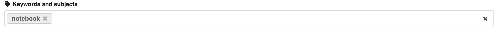

# **Submission Requirements and Process**

## **📌 Submission Requirements**

To ensure your notebook can be successfully published in the gallery, please adhere to the following guidelines:

### **1. File Format & Organization**
Each submission must contain **A compressed `.zip` archive** containing:
- The notebook(s) and/or markdown files.
- All necessary code, data, and images.
- **A valid `index.yaml` (see details below).**

If submitting multiple files, ensure they are **properly structured**.

### **2. Package Dependencies**
- Clearly **list all package versions** required to run your notebook.
  - Example: `numpy==1.21.0, pandas==1.3.3, geopandas==0.9.0`
  - You can include this in a markdown cell or as a `requirements.txt` file.

### **3. Required Metadata**
- **Your submission must include a keyword** in its Zenodo metadata. Accepted keywords are:
  - `notebook`
  - `workshop`
  - `tutorial`

Fill this part in Zenodo submission:


### **4. Required index File**
**Your submission must include an `index.yaml` file** to define the structure. This file **organizes your content** into main sections and subsections. 
The order of files in `index.yaml` will be respected** in the gallery.

**Examples of Valid `index.yaml` Files** 
**Single Notebook Submission**
```yaml
- file: create_dataset/create_dataset.ipynb
```

**Multiple Files with an Organized Index**
```yaml
- file: 20220131/agenda
  sections:
    - file: 20220131/session1/session1-jupyter-intro.ipynb
    - file: 20220131/session2/session2-hazard.ipynb
    - file: 20220131/session3/session3-building_damage_analysis.ipynb
    - file: 20220131/session4/session4-damage-analyses-lifelines.ipynb
```

**Multiple Files (Flat Structure)**
```yaml
- file: 20231115/session2/session2-remote-and-local-hazards.ipynb
- file: 20231115/session2/session2-assignment.ipynb
- file: 20231115/session2/session2-assignment-answers.ipynb
```
📌 **The order in `index.yaml` will be preserved** when displayed in the gallery.

---

## **Submission Process**
Follow these steps to submit your notebook for publication:

### **1. Upload to Zenodo**
- Submit your notebook and associated files to the **IN-CORE Zenodo community** [here](https://zenodo.org/communities/in-core/records?q=&l=list&p=1&s=10&sort=newest).
- If submitting multiple files, **compress everything into a `.zip` file**.

  *Mac Users:* Before compressing, remove unnecessary system files:
  ```bash
  zip -d filename.zip __MACOSX/\*
  zip -d filename.zip \*/.DS_Store
  ```

### **2. Fill in Zenodo Metadata**
When uploading your submission, complete the following fields:

| **Field**                | **Required Information** |
|--------------------------|-------------------------|
| **Digital Object Identifier (DOI)** | Select "Get a DOI now" if none exists. |
| **Resource Type**        | Choose **Software / Computational Notebook**. |
| **Title**                | Provide a **clear and descriptive title** for your notebook. |
| **Creator(s)**           | List all **co-authors**. |
| **Funding (if applicable)** | Include funding sources, if relevant. |
| **Keywords**             | Must include **"notebook"**, **"workshop"**, or **"tutorial"**. |

### **3. Include `index.yaml`**
Your **index.yaml** should define the structure of your content.

---

## **Summary**
✔ **Notebooks must be standalone (`.ipynb`) or inside a `.zip`.**  
✔ **Must include a `keyword` ("notebook", "workshop", or "tutorial").**  
✔ **Must contain `index.yaml` defining content structure.**  
✔ **Must specify package dependencies.**  
✔ **Upload to Zenodo with correct metadata fields: notebook, workshop, tutorial**
✔ **The order of notebooks in `index.yaml` will be respected in the gallery.**  

---

### **Start Your Submission Now!**
Upload your notebook: [IN-CORE Zenodo Community](https://zenodo.org/communities/in-core/records?q=&l=list&p=1&s=10&sort=newest)  
